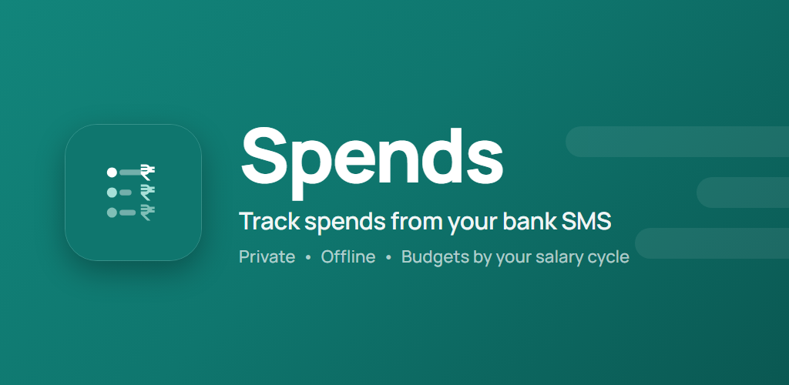

# Spends

**A private, offline-first expense tracker for Android that budgets around _your_ salary and card cycles — and turns your bank's SMS alerts into one-tap entries.**

Most trackers make you do the work: type every spend, and read your balance against a calendar month that has nothing to do with when you actually get paid. **Spends flips both.** It reads your bank's transaction SMS *entirely on your phone* so logging is a single tap, it learns your habits as you go, and it shows what's really left to spend based on your salary cycle and each card's billing cycle. No account, no ads, no analytics — every rupee stays on your device (backup, if you want it, goes to your *own* Google Drive).

---

## ✨ Features

### 🗓️ Smart Cycle — budget by how you're actually paid
The heart of Spends. Instead of a calendar month, it tracks money by **your salary cycle** *and* **each credit card's own billing cycle**. The headline balance is your **true remaining salary**: what has already left your bank, *plus* the card spends you'll owe when each card's statement generates. Every card is bucketed into its own billing window, so a swipe counts against the right cycle — not today's date.

> "Shows your true remaining salary — what's already left your bank, plus card spends you'll owe when each card's bill generates. Every card is tracked on its own billing cycle."

### 🔁 Recurring Automation — set it once, it logs itself
Add rent, salary, EMIs and subscriptions once and Spends materialises the real transactions on schedule — daily / weekly / monthly / yearly, every *N* periods. A fixed run like a 12-month EMI stops itself after the final occurrence. An **exact daily alarm** (default 9:00 AM, configurable) generates what's due and reminds you — reliably, even under Doze — and re-arms itself after a reboot. Missed days are backfilled, and nothing is ever double-created.

### 📩 SMS Detect + Self-Learning — capture spends the moment they happen
When a bank or card SMS arrives, Spends spots the transaction **on-device** and offers a one-tap **Add / Edit / Ignore**. Nothing is auto-added and nothing leaves your phone. It gets smarter the more you use it:

- **Learns your categories** — confirm or re-categorise a captured spend, and Spends remembers that *merchant → category* for next time.
- **Learns what you ignore** — dismiss the same kind of alert a few times and Spends stops nagging you about it, quietly filing it in your review queue instead of dropping it.
- **Auto-matches the right card** by last-4 digits, and can **discover your cards** and detect each card's **statement day** from your SMS history.

Parsing is a strict, rules-based engine covering ~25 Indian banks, cards and wallets — it never touches OTPs, promos or EMI-conversion offers.

### ✂️ Category Split — one payment, many categories
Split a single bill across categories (groceries *and* household in one swipe). Multi-select the categories, give each its own amount with a live **"₹ left to assign"** remainder and its own note, and Spends saves **each slice as its own clean transaction**.

### 🔍 Search — find anything fast
Search your timeline by **merchant, note or category**. In the SMS review queue, search goes wider — amount, merchant, bank, card last-4, and even the **raw message text** — with quick Expense / Income filters.

### 📊 Analytics — see where it goes
A **category donut** with a tappable legend that drills into that category's transactions, a **spend-over-time** bar view, a **per-instrument breakdown** in Smart Cycle, and a **recurring summary**. Every category drill-down shows a **monthly average** over a trailing 3M / 6M / all-time window. All charts are hand-drawn in Compose — no heavyweight chart library.

---

### More that's built in

- **💳 Banks & Cards** — manage every card and bank/UPI account; per card, see the **current cycle's spend**, transaction count and **statement-day** label, and set a default "Paid with" instrument.
- **🧮 Calculator keypad** — type `1200+350` right in the amount field; correct ×÷-before-+− precedence and exact decimal math.
- **🏠 Home-screen widgets** — a one-tap **quick-add**, and a **summary widget** showing your cycle's Income / Expense / Balance, **masked by default** with a tap-to-reveal eye (which can be made invisible-but-still-tappable for shoulder-surfing privacy).
- **☁️ Google Drive backup** — optional, to **your own** Drive (a visible "Spends Backup" folder), covering everything: transactions, splits, categories, recurring rules, cards and settings. Optional **AES-256 password encryption**, a daily auto-backup, plus local file **export/import** — all with no account.
- **↩️ Trash & undo** — swipe-to-delete with instant **Undo**; a Trash bin restores or deletes-forever and auto-purges old items.
- **🔀 Carry-forward** — roll each period's leftover into the next, from an anchor date you choose.
- **🎨 Auto categories & theming** — categories get a distinct **icon and colour automatically** (no fiddly pickers); **Light / Dark / System / Auto** (auto flips to dark on your schedule).
- **📥 Spreadsheet import/export** — bring history in from **Monito** or a generic Excel/CSV (duplicates skipped), or export a readable spreadsheet.

---

## 🔒 Private by design

No account. No ads. No analytics or telemetry. Your SMS and transactions are parsed and stored **on-device**, as integer paise (money never touches floating point, and rupees use Indian digit grouping — `12,34,567.00`). The only network Spends ever uses is **your own** Google Drive backup, and only if you turn it on.

---

## 🛠️ Under the hood

- **Kotlin + Jetpack Compose + Material 3**, edge-to-edge, a hand-tuned brand palette (light/dark/system/auto).
- **MVVM** with **Hilt**, **Room** (schema v13), **DataStore**, Coroutines/Flow, **WorkManager** + **exact AlarmManager**.
- 100% offline; all money is `Long` paise end-to-end.
- Correctness-critical logic — money formatting/parsing, salary/card cycle windows, the SMS parser (30 golden fixtures gate every release), largest-remainder splits — is covered by JUnit tests under `app/src/test`.
- Feature-first, layered architecture (`core/`, `data/`, `domain/`, `ui/`, `di/`). See `docs/PHASE_PLAN.md` and `docs/PLATFORM_NOTES.md`.

### Build (cloud only)

This project builds in **GitHub Actions**, not locally.

- Push to `main` → **Debug APK** workflow → installable debug artifact.
- Push a tag `vX.Y.Z` → **Release** workflow → **signed APK + AAB** attached to a GitHub Release.

Signing secrets (repo → Settings → Secrets → Actions): `KEYSTORE_BASE64`, `KEYSTORE_PASSWORD` (key alias `spends`). See `.github/workflows/android-release.yml`.

---

## 📦 Getting Spends

Grab the latest **signed APK** from the [**Releases**](https://github.com/aucksy/spends/releases) page and sideload it. A Google Play listing is in preparation (see `play/`).

> **Note on SMS:** SMS auto-capture is optional — Spends is fully usable with quick manual entry — and all parsing happens on-device. `READ_SMS` is a Play-restricted permission, so the SMS feature is offered under a prominent in-app disclosure.

---

## 🔐 Privacy

No account, no ads, no analytics, no telemetry on financial content. SMS parsing happens entirely on-device; backup goes only to your own Google Drive. See the [privacy policy](https://aucksy.github.io/spends/). Never commit raw SMS exports, account numbers, or personal spreadsheet exports — see `.gitignore`.
