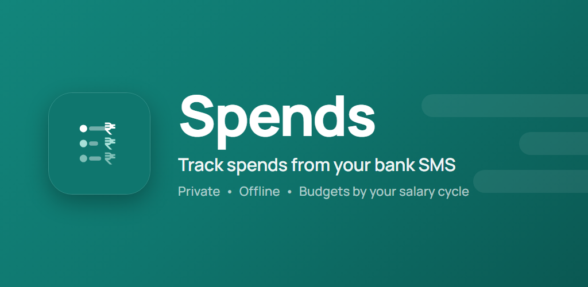

# Spends

**A private, offline-first expense tracker for Android that budgets around _your_ salary and card cycles — and turns your bank's SMS alerts into one-tap entries.**

Most trackers make you do the work: type every spend, and read your balance against a calendar month that has nothing to do with when you actually get paid. **Spends flips both.** It reads your bank's transaction SMS *entirely on your phone* so logging is a single tap, it learns your habits as you go, and it shows what's really left to spend based on your salary cycle and each card's billing cycle. No account, no ads, no analytics — every rupee stays on your device. Backup, if you want it, goes to your *own* Google Drive.

---

## ✨ Features

### 🗓️ Smart Cycle — budget by how you're actually paid
The heart of Spends. Instead of a calendar month, it tracks money by **your salary cycle** *and* **each credit card's own billing cycle**. The headline balance is your **true remaining salary**: what has already left your bank, *plus* the card spends you'll owe when each card's statement generates. Every card is bucketed into its own billing window, so a swipe counts against the right cycle — not today's date.

> "Shows your true remaining salary — what's already left your bank, plus card spends you'll owe when each card's bill generates. Every card is tracked on its own billing cycle."

### 🔁 Recurring Automation — set it once, it logs itself
Add rent, salary, EMIs and subscriptions once and Spends materialises the real transactions on schedule — daily / weekly / monthly / yearly, every *N* periods. A fixed run like a 12-month EMI stops itself after the final occurrence. An **exact daily alarm** (default 9:00 AM, configurable) generates what's due and reminds you — reliably, even under Doze — and re-arms itself after a reboot. Missed days are backfilled, and nothing is ever double-created.

### 📩 SMS Detect + Self-Learning — capture spends the moment they happen
When a bank or card SMS arrives, Spends spots the transaction **on-device** and posts a notification with two actions: **Review & Add** — which opens the entry pre-filled so you check it and tap Save — or **Ignore**. **Nothing is ever added without your confirmation.** Your messages are parsed on-device, and nothing derived from them leaves the phone. It gets smarter the more you use it:

- **Learns your categories** — confirm or re-categorise a captured spend, and Spends remembers that *merchant → category* for next time.
- **Learns what you ignore** — tap Ignore on the same alert three times and Spends stops interrupting you about it, quietly filing it in your review queue instead of dropping it.
- **…and lets you undo that** — **Silenced alerts** lists everything Spends has gone quiet on, *and* everything one Ignore away from it, each with a one-tap **Ask me again**. An accidental Ignore is always reversible.
- **Auto-matches the right card** by last-4 digits, and can **discover your cards** and detect each card's **statement day** from your SMS history.

Parsing is a strict, rules-based engine covering **16 Indian banks, cards and wallets across 55 sender IDs**, plus **13 Malaysian banks and wallets** (HDFC, ICICI, SBI, SBI Card, Axis, IDFC First, IndusInd, Yes, RBL, PNB, Amex, OneCard, CRED, Paytm, MobiKwik, L&T Finance) — it never touches OTPs, promos, declined transactions, statements, future-dated mandates or EMI-conversion offers.

### 💬 Notification capture — the RCS gap-closer
Some banks now send alerts as **RCS chat messages or Truecaller "Business Chat"** rather than SMS — and *no* app can read those as SMS, so every SMS-based tracker silently misses them. Spends can optionally read transaction alerts from the messaging apps you tick (Google Messages, Truecaller) instead. Same rule as SMS: parsed on-device, and nothing is added until you confirm it. Android keeps no notification history, so this works from the moment you switch it on.

### ✂️ Category Split — one payment, many categories
Split a single bill across categories (groceries *and* household in one go). Multi-select the categories, give each its own amount with a live **"₹ left to assign"** remainder and its own note, and Spends saves **each slice as its own clean transaction**.

### 🔍 Search — find anything fast
Search your timeline by **merchant, note or category**. In the SMS review queue, search goes wider — amount, merchant, bank, card last-4, and even the **raw message text** — with quick Expense / Income filters.

### 📊 Analytics — see where it goes, and where it came from
A **Spending / Income toggle** runs the whole page: the **category donut** with its tappable legend and the **over-time** bar view both switch sides of the ledger, so "which categories did I earn from this cycle?" is the same question, asked the same way, as "which did I spend on?". Plus a **per-instrument breakdown** in Smart Cycle and a **recurring summary**. Each category drill-down leads with what **this cycle** cost and states the comparison **in a sentence** — *"About ₹1,500 more than your usual month"* — with "usual" averaged over a trailing 3M / 6M / all-time window you choose. A **Yearly** view gives the same treatment year-on-year, compared per month so a part-finished year still compares fairly. All charts are hand-drawn in Compose — no heavyweight chart library.

### 💱 Multi-currency — rupees, ringgit or dollars
Keep your books in **₹ INR**, **RM MYR** or **$ USD**. The choice is a rendering decision, not a rewrite: switching it changes the symbol and the digit grouping (Indian `12,34,567` for rupees, `1,234,567` for the rest) and never touches a stored figure. It travels in your backup, so restoring onto a new phone doesn't quietly put you back in rupees.

The SMS parser reads foreign amounts too — `RM 250.00`, `USD 42.10`, `SGD 88.00` — and Malaysian senders (Maybank, CIMB, Public Bank, RHB, Hong Leong, AmBank, Bank Islam, OCBC, UOB, HSBC, Touch 'n Go, Boost, GrabPay) are recognised alongside the Indian ones. A rupee amount is always matched first, so nothing about an Indian alert changes.

### 🤖 AI currency conversion — optional, your key, and it shows its working
When an alert arrives in a currency you don't keep books in, Spends can convert it and **tell you exactly what it did**: every converted transaction carries `RM 100.00 → ₹1,890.00 · 1 MYR = ₹18.90` on its face.

- **Bring your own key** — Anthropic (Claude), OpenAI or Groq, pasted in *Settings → Currency & AI*, encrypted on-device, never in a backup, never shown back to you, with a **Test key** button that proves it works before you rely on it.
- **What's sent is only a rate question** — *"How many INR is 1 MYR right now?"*. No amount, no merchant, no card number, no message text. Rates are cached six hours, so a day of alerts costs one call.
- **Or skip the AI entirely** — pin your own rate for a currency pair and Spends uses that, with no network call at all.
- **It can't quietly get it wrong** — the rate is sanity-checked, an answer about the wrong currency pair is thrown away, and if no conversion is possible the transaction is held in the review queue **flagged and in its original currency** rather than being logged as the wrong number. "Add all" refuses to bulk-commit those.
- **Honest about accuracy** — the rate is the model's estimate, not a live market feed. The app says so, shows the rate on every transaction, and lets you override it.

---

### More that's built in

- **💳 Banks & Cards** — manage every card and bank/UPI account; per card, see the **current cycle's spend**, transaction count and **statement-day** label, and set a default "Paid with" instrument.
- **🧮 Calculator keypad** — type `1200+350` right in the amount field; correct ×÷-before-+− precedence and exact decimal math.
- **🏠 Home-screen widgets** — a one-tap **quick-add**, and a **summary widget** showing your cycle's Income / Expense / Balance, **masked by default** with a tap-to-reveal eye (which can be made invisible-but-still-tappable for shoulder-surfing privacy).
- **☁️ Google Drive backup** — optional, to **your own** Drive (a visible "Spends Backup" folder), covering everything: transactions, splits, categories, recurring rules, cards and settings. Optional **AES-256 password encryption**, a daily auto-backup, plus local file **export/import** — all with no account.
- **↩️ Bulk edit, Trash & undo** — long-press any row to multi-select, then **bulk delete or bulk re-categorise** with an instant **Undo**; a Trash bin restores or deletes-forever and auto-purges after 30 days. (There is deliberately **no swipe-to-delete** — it caused too many accidental deletes and re-categorisations.)
- **🔀 Carry-forward** — roll each period's leftover into the next, from an anchor date you choose.
- **🎨 Auto categories & theming** — categories get a distinct **icon and colour automatically** from their name, with an icon picker (~90 icons in 8 groups) if you'd rather choose; **Light / Dark / System / Auto** (auto flips to dark between two times you set).
- **📥 Spreadsheet import/export** — bring history in from **Monito** or a generic Excel/CSV (duplicates skipped), or export a readable spreadsheet.

---

## 🔒 Private by design

No account. No ads. No analytics or telemetry. Your SMS and transactions are parsed and stored **on-device**, as integer minor units (money never touches floating point; rupees use Indian digit grouping — `12,34,567.00`). Spends makes two network calls, both off by default and both switched on by you: **your own** Google Drive backup, and AI currency conversion — which sends a bare exchange-rate question and no transaction data. Pin your own rate and even that goes away.

---

## 🛠️ Under the hood

- **Kotlin + Jetpack Compose + Material 3**, edge-to-edge, a hand-tuned brand palette (light/dark/system/auto).
- **MVVM** with **Hilt**, **Room** (schema v17), **DataStore**, Coroutines/Flow, **WorkManager** + **exact AlarmManager**.
- Offline by default — the only network calls are your own Google Drive backup and, if you switch it on and add your own API key, AI currency conversion (which sends a bare exchange-rate question and no transaction data); all money is `Long` minor units end-to-end.
- Correctness-critical logic — money formatting/parsing, salary/card cycle windows, the SMS parser (56 golden fixtures gate every release), largest-remainder splits — is covered by **398 JUnit tests** across 35 files under `app/src/test`.
- Feature-first, layered architecture (`core/`, `data/`, `domain/`, `ui/`, `di/`). See `docs/PHASE_PLAN.md` and `docs/PLATFORM_NOTES.md`.

### Build (cloud only)

This project builds in **GitHub Actions**, not locally.

- Push to `main` → **Debug APK** workflow → installable debug artifact.
- Push a tag `vX.Y.Z` → **Release** workflow → **signed APK + AAB** attached to a GitHub Release.

Signing secrets (repo → Settings → Secrets → Actions): `KEYSTORE_BASE64`, `KEYSTORE_PASSWORD` (key alias `spends`). See `.github/workflows/android-release.yml`.

---

## 📦 Getting Spends

Grab the latest **signed APK** from the [**Releases**](https://github.com/aucksy/spends/releases) page and sideload it. A Google Play listing is in preparation (see `play/`).

> **Note on SMS:** SMS auto-capture is optional — Spends is fully usable with quick manual entry — and all parsing happens on-device. `READ_SMS` is a Play-restricted permission, so the SMS feature is offered under a prominent in-app disclosure.

---

## 🔐 Privacy

No account, no ads, no analytics, no telemetry on financial content. SMS parsing happens entirely on-device and **no transaction detail derived from a message ever leaves the phone**; backup goes only to your own Google Drive. **No personal or financial data is shared with any third party.**

One optional feature makes a third-party call: **AI currency conversion** (off by default, needs your own API key). What it sends is a bare exchange-rate question — *"How many INR is 1 MYR right now?"* — and **never an amount, merchant, card number or message text**. Your key is encrypted on-device, excluded from backups, and only ever sent to the provider you pick. Pin your own rate instead and it makes no call at all. (A different AI helper existed in v1.56.0–v1.64.0 and *did* send number-masked transaction data; it was removed in v1.65.0 and its stored key is erased on the next launch.)

If you change what leaves the phone, the disclosure sweep is: this file (two places), `docs/index.html`, `play/DATA_SAFETY.md`, `play/DATA_SAFETY_WALKTHROUGH.md`, `play/PERMISSIONS_DECLARATION.md` and `play/listing/store-listing.md`. See the [privacy policy](https://aucksy.github.io/spends/). Never commit raw SMS exports, account numbers, or personal spreadsheet exports — see `.gitignore`.
